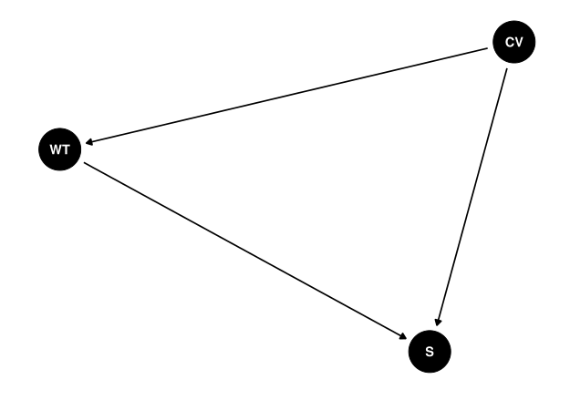
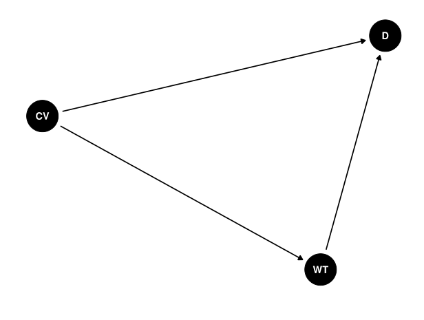

```{r setup, include=FALSE}
knitr::opts_chunk$set(echo = TRUE)
```

```{r global_options, include=FALSE}
knitr::opts_chunk$set(fig.pos = 'H')
```

```{r, include=FALSE}
library(tidyverse)
library(knitr)
library(tibble)
library(ggdag)
library(stargazer)
library(survival)
library(tinytex)
library(kableExtra)
library(tidyr)
library(broom)
```
\newpage

# 0. Replication files

The replication data set for Matthew Moore's article "Selling to both sides" is available [here](https://dataverse.harvard.edu/dataset.xhtml?persistentId=doi:10.7910/DVN/8PKAI0)

The original article is available [here](https://www.tandfonline.com/doi/pdf/10.1080/03050629.2012.676511?casa_token=JNzRApl8w24AAAAA:Sth2YQPRDCYC-RSAX90DJVyzofnIauIWa9eU7561mATdM_fm2NdfEJHqKdOOavQeNwlJNLF-mvJExw ) 

The rmd file used to create this report as well as all complementary files can be accessed [here](https://github.com/carlo-gress/causal_selling_to_both_sides)

```{r, include=F}
load("Replication files\\moore selling to both sides Internaitonal Interactions.RData")

moore_replication <- x
```

```{r, include=F}
# Data transformations for later analysis

moore_replication$new_lstarmimp5 <- log(moore_replication$starmimp5)

moore_replication[is.na(moore_replication) | moore_replication == "-Inf"] <- NA

moore_replication_subset = moore_replication %>% 
  subset(sipricomp == 1) %>% 
  subset(conflict_name != "Vietnam War")
```

# 1. Introduction: Moore’s hypotheses, expected mechanisms, and data sources  
This final project provides a methodological critique of the article "Selling to both sides: The Effects of Major Conventional Weapons Transfers on Civil War Severity and Duration" [@moore2012selling]. After a summary of the research objective and hypothesis, the used data, and results, I will discuss certain issues and difficulties with Moore's approach. Moreover, I provide a corrected version of some of his models. 

Moore examines how transfers of certain types of weapons impact both a civil war's duration as well as its severity. More specifically, the article distinguishes between weapon transfers to rebel groups and weapon transfers to governments and compares potentially deviating effects. Regarding weapon characteristics, only a certain weapon type is considered: Major conventional weapons (MCW). Since the author uses the Stockholm International Peace Research Institute's (SIPRI) definition of MCW, this most importantly includes aircraft, armoured vehicles, artillery, sensors, air defence systems, missiles, and ships. On the other hand, small arms and light weapons such as pistols and machine guns are excluded from the analysis. 

Using data from the Peace Research Institute Oslo (PRIO) on conflicts and SIPRI data on weapon transfers, Moore examines the effect of transfers of these weapons to both rebels and governments on two distinct dependent variables: the conflict's severity and the conflict's duration. Severity is measured by the number of battle-related deaths during the respective conflict. Duration is measured in whole years. He tests four hypotheses: Regarding the severity of civil conflicts, he states that MCW transfers to both rebel groups (H1) as well as to governments (H2) will increase the severity of a conflict (thus increase the number of battle-related deaths). These hypotheses arise from the expected causal mechanism that MCW have the potential to escalate a civil conflict, especially when rebels are able to acquire them. On the other hand, and although Moore acknowledges a potentially deterring effect of MCW in the hands of governments, he argues that MCW contribute to a higher severity once a conflict broke out. Ultimately, he concludes that both transfers to rebels and governments will increase the severity of a civil conflict. 

Regarding the duration of civil conflicts, Moore expects diverging effects of MCW transfers when rebels and governments are considered: MCW transfers to rebels should decrease a conflict’s duration (H3), while transfers to governments are expected to increase the duration (H4). Concerning the expected conflict-shortening effect of MCW transfers to rebels, the author argues that MCW increase the rebels’ fighting capacity, which ultimately results in a more credible threat to governments. Subsequently, governments may be willing to negotiate peace settlements, which would ultimately terminate the conflict and shorten the conflict duration. The last hypothesis is underpinned by the expectation that additional weapons are only marginally improving a government’s relative strength.


# 2. Applied method and main results of the original article 

In order to test these four hypotheses, Moore specifies several models. For the hypotheses on conflict severity, the author ran five distinct ordinary least squares regression models with diverging specifications of the weapon import variable. Besides a model that replicates a previous study [@lacina2006explaining], the author differentiates between models that only include weapon imports during the conflict and a model that also accounts for weapon imports that happened five years before the outbreak of a conflict. Additionally, two models include a variable indicating third-party interventions. 

To test the hypotheses on conflict duration, Moore specified a Cox proportional hazard model. In both the OLS regression as well as in the cox regression, several control variables that have been found significant in previous literature examining similar problems are included. Moore controls for population size, military quality, GDP, a binary cold war indicator, a binary indicator indicating mountainous terrain, a binary democracy indicator, ethnic polarization, religious polarization, and a binary variable indicating whether there have been third-party interventions. 

As the main results, Moore finds significant regression coefficients within all model specifications for the effect of weapon transfers to rebels (logged) on the number of battle-related deaths. The logarithmic transformation of the import variable is justified by the original distribution of its values. Hence, he confirms the first hypothesis. Regarding the second hypothesis, the only significant coefficient of weapon transfers to governments is found within the model including imports prior to conflict outbreaks and third-party interventions. He therefore partially confirms the second hypothesis. However, additional previous literature pointed out that this result is flawed due to a coding mistake concerning the weapon import variable [@mehrl2020military]. Subsequently, the significant effect identified by Moore could result from this prior mistake. After the general methodological critique, this final project seeks to replicate the original analysis with a corrected version of the weapon import variable to states priot to the conflict outbreak and to discuss potentially deviating results.

Moreover, Moore rejects the third hypothesis regarding the effect of transfers to rebels and shortened conflict duration. Ultimately, the fourth hypothesis is confirmed, as the Cox regression model found significant coefficients for the effect of governmental weapon imports and conflict duration. 

Figure 1 shows an illustration of the expected causal mechanism in a directed acyclic graph (DAG), where S represents the first dependent variable, severity, WT represents the main independent variable, weapon transfers to rebels and governments, and CV represents the mentioned control variables. The author expects a positive effect of weapon transfers on the number of battle-related deaths, independently of the recipient. Regarding the control variables, previous literature implied relevant effects on both weapon transfers and the severity of a conflict. Exemplarily, population size can be expected to be interlinked with a greater number of battle-related deaths since there commonly are more actors involved, and similarly affects the number of imported weapons. Causally speaking, and as to be retrieved from the DAG in Figure 1, the control variables therefore might confound the relationship between weapon transfers and the severity of a conflict. Including the control variables in the regression models subsequently blocks the paths between the control variables and weapon transfers, and allows for observing the direct effect of weapon transfers and conflict severity. 


```{r, include=F}
dag = dagify(S ~ WT,
             S ~ CV,
             WT ~ CV)
ggdag(dag) +  theme_dag_blank()
```

```{r fig1, eval = TRUE, echo = FALSE, out.width = '100%', fig.cap=paste("DAG for relationship between weapon imports and conflict severity")}

```

Figure 2 shows the visual representation of the original third and fourth hypotheses on the duration of civil conflicts. Again, the identical control variables are included. In contrast to the hypotheses on conflict severity, Moore expects a different effect direction of weapon transfers, depending on whether the weapons are transferred to rebels (conflict-shortening effect) or governments (conflict-prolonging effect). 
 
```{r, include=F}
dag2 = dagify(D ~ WT,
             D ~ CV,
             WT ~ CV)
ggdag(dag2) +  theme_dag_blank()
```

```{r fig2, eval = TRUE, echo = FALSE, out.width = '100%', fig.cap=paste("DAG for relationship between weapon imports and conflict duration")}

```

# 3. Method Review 
This section seeks to point out potential issues of the article by Moore, both from a causal perspective as well as with regards to the original coding decisions made by the author. An important constraint for making causal statements in the whole domain of peace and conflict studies is an endogeneity problem arising from both omitted variables and simultaneity. Moore states that looking at weapon imports separately from other types of third-party intervention solves potential endogeneity issues. His main argument for this claim is that while other forms of third-party intervention, such as sending physical troops, might have a simultaneous relationship with increased casualties, the effect direction between weapon imports and severity is unilateral. The first part of this argument seems reasonable: Additional troops might lead to an escalation of the conflict and a higher death toll, while a higher death tool might simultaneously lead to the decision of sending additional troops for supporting a certain conflict party. However, the subsequent statement – stating that weapon imports have the potential to affect a conflict’s severity but a reversed mechanism is not conceivable - is questionable. Quite the contrary, it seems reasonable to assume that especially the state party involved in a civil conflict anticipates certain developments surrounding the threat of a conflict outbreak. Similarly, governments might also – in reaction to increasing casualties – strategically decide to import new weapons. This expectation is supported by previous literature examining the relationship between foreign aid and military expenditure [@collier2007unintended]. Hence, weapon imports could be both the *driver* and a *result* of conflict severity and are not a random governmental decision that can be seen independent of conflict developments. This would imply an endogeneity issue due to simultaneous causality [@bascle2008controlling]. Following recent literature on endogeneity and endogenous selection bias in social science applications, authors pointed out that this endogeneity problem leads to biased and inconsistent estimators [@glymour2016causal; @elwert2014endogenous]. Applied to the analysis under examination, this subsequently implies that the calculated coefficients of the respective weapon import variable are biased and do not resemble the *true* effect of weapon imports on a conflict’s severity. 

Although Moore concluded that this endogeneity issue only arises when other forms of third-party interventions are considered, more recent previous literature came to deviating conclusions and pointed toward an endogenous relationship between weapon imports and conflict trends [@mehrl2020military, page 1178]. To counteract this problem, Mehrl and Thurner introduce an instrumental variable approach as a potential solution to this endogeneity problem. The idea behind this approach is to include an additional variable (the instrument) that is correlated with the respective independent variable but not with the outcome and use it for providing exogenous variation in the independent variable. Applied to this analysis, one would need to include only one instrumental variable that is correlated with the imports of MCW but not with conflict severity and duration.

Since Mehrl and Thurner examine both MCW and SALW, they include two instrumental variables: for MCW imports, the authors include imports of MCW not or only to a very limited extent suitable for intrastate conflicts. This approach had been previously picked up by other researchers [@pamp2018build]. Here, the authors argue that certain MCW (air defence, submarines, ships, satellites) are rarely used in civil conflicts and rather are used in interstate wars and are therefore a suitable instrumental variable. Similarly, Mehrl and Thurner use sporting and hunting weapons as an instrument for SALW imports, arguing that these weapons are rarely used during conflict. They find that governmental arms imports can render conflicts more violent, but only in those cases where rebels are roughly equally strong.

As a preliminary result, it can be argued that Moore’s methodological framework has a clear weakness with regard to the endogeneity issue. Looking at related, more recent literature, authors pointed toward this problem and used instrumental variable approaches in order to account for it. Using MCW that are not suitable for intrastate conflict as an instrumental variable to account for endogeneity issues has been a promising approach in recent literature and could be applied to Moore’s analysis to test the robustness of his results. 

# 4. Coding decisions and flaws
Besides the more general endogeneity issue, another potential weakness of the article is some of the operationalisations and measurements of the key variables. One general difficulty of studies that examine the severity of conflict is to implement a coherent and succinct measurement of severity. Like many related studies, Moore uses the notion of battle-related deaths as an indicator of a conflict’s severity. Although this is a common approach in related literature, there are some individual adjustments that researchers can make that might significantly influence the overall results. Regarding the overall case-selection process, the potentially most impactful decision is to determine at what threshold a conflict is considered in the analysis. Moore follows a threshold of 900 battle-related deaths that happened during the whole conflict. This is different from the general criteria of UCDP for including a conflict, which is a threshold of 25 battle-related deaths per year. Additionally, there also is alternative literature and datasets which use a higher threshold (more than 1,000 battle-related deaths per year, exemplarily in the Correlates of War dataset). The general approach of UCDP is also recommended by previous literature on methodological coding decisions [@gates2004modeling]: These authors argue that setting a lower casualty threshold per year prevents systematic neglect of conflicts in countries with generally lower population numbers and hence a selection bias which is in favour of larger countries. However, the yearly-measured death figure approach comes with a certain difficulty addressed by Gates and Strand: Independently of the threshold set by the researcher, some conflicts occasionally experience a drop in casualty figures due to certain developments. When the number of battle-related deaths drops under the specified threshold, the conflict is not considered in the UCDP dataset anymore. From a theoretical perspective, this could be especially problematic if the conflict is actually not resolved (e.g. due to a decisive defeat of one conflict party or a peace agreement) but rather continues with a temporarily reduced intensity. If the threshold is then exceeded again in a later year, UCDP would include it as an inherently independent conflict, although it is likely that the central actors and causes of war have stayed identical. In such cases, it could be beneficial to recode the sample in a way that these conflicts are treated as coherent. As proposed by Gates and Strand, one possibility could be to code “interrupted” conflicts as coherent when the period of inactivity is comparatively short. More concretely, previous research suggested to code conflicts with interruptions that lasted two years maximum as coherent and conflicts with longer inactive periods as separate [@gates2004modeling]. 

As already introduced, Moore is not discussing such considerations in his article since he is using an approach that accumulates the death figures over time instead of considering every conflict year separately. Although this partially circumvents the above-mentioned issues, this has the disadvantage of a potentially systematic neglect of shorter conflicts. Even if a conflict would experience high levels of violence and battle-related deaths but stays below the threshold of 900 battle-related deaths and is then resolved quickly, the conflict would not be considered in Moore’s sample. Hence, these decisions are not only affecting the general case number under examination but also the second dependent variable of his article (duration). The article could already be improved if the author would have provided a more transparent discussion of the sample selection and/or the alternative approach of concentrating on conflict years instead of overall death tolls for the sample selection. Looking at related literature on weapon imports and conflict trends, a sample selection based on UCDP’s battle-related death threshold per conflict year seems more widely used than Moore’s threshold, which seems quite arbitrary. Another disadvantage of this varying case selection across studies is reduced comparability of results. Moore’s article might systematically leave out conflicts that usually are included in analyses examining conflict intensity. 

Ultimately, Mehrl and Thurner pointed toward a coding mistake in Moore’s article which potentially leads to flawed effect estimates. More specifically, the weapon’s import variable for governments was logged twice. Obviously, the correct model specification intended to take the log only once to account for the original distribution of the import variable. However, Moore interprets the calculated estimates as if the variable would have been logged only once, and finds significant effects of governmental imports on conflict intensity. In order to verify the claim of a flawed logarithmic transformation, let’s briefly look at the dataset used by Moore, more specifically the first ten observations:

```{r, include=F}
table1 = moore_replication_subset %>%
  select(starmimp5, lstarmimp5) %>%
  head(., 10)
```

```{r, echo=F}
table1 %>% 
  kable(caption = "Original import variable and wrongly transformed version",
    col.names = c("Arms imports (states)", "Ln arms imports (states)"),
    digits = c(0,2)) %>%
  kable_styling(latex_options = "HOLD_position")
```

As we can see, the values of the logged governmental arms import variable that captures all imports that were made five years before the outbreak of the conflict are flawed. The other import variables used by Moore – both for state imports during imports and both versions of the rebel import variable – are specified correctly. Hence, four of Moore’s models are affected: Models 3, 5, 7 and 9. In the next step of this final project, I am correcting the coding error and replicating Moore’s models to be able to observe potential deviations. 

```{r, echo=F}
lm(lnbdb ~ new_lstarmimp5 + lrarmimp5 + lnduration + lnpop + lnmilqual + lngdp + cw + lnmountain + democ  + ethnicpolar + relpolar, data = moore_replication_subset) %>% 
  tidy() %>% 
   mutate(
    term = c("Intercept", "Ln Arms imports (state)", "Ln Arms imports (rebels)", "Ln
    duration", "Ln population",
             "Ln military quality", "Ln GDP", "Cold War", "Ln Mountainous
             Terrain", "Democracy", "Ethnic polarization", "Religious polarization")) %>%
  kable(
    caption = "Replication of Model 3 with corrected 5-year import variable",
    col.names = c("Predictor", "B", "SE", "t", "p"),
    digits = c(0, 2, 3, 2, 3)) %>%
  kable_styling(latex_options = "HOLD_position")
```


Looking at model 3 with the corrected specification of the governmental imports variable and comparing it to the original estimates made by Moore, we can see that both the coefficient value as well as the significance has changed. While Moore concluded that governmental arms imports before the conflict outbreak significantly increase the number of battle-related deaths, the corrected version implies that there is no identifiable effect. Thus, the significant effect of governmental arms imports was due to the coding mistake and does not imply a real effect. Besides the changed effect of the governmental imports variable, the other coefficients of the included variables also changed. However, the effect size of rebel weapon imports, which was specified correctly by Moore, only changed to a minor extent and stayed in the same direction. Also, the significance of these variables was not affected by replacing the flawed governmental import variable. 

```{r, echo=F}
lm(lnbdb ~ new_lstarmimp5 + lrarmimp5 + lnduration + lnpop + lnmilqual + lngdp + cw + lnmountain + democ + ethnicpolar + relpolar + intervention, data = moore_replication_subset) %>% 
  tidy() %>% 
  mutate(
    term = c("Intercept", "Ln Arms imports (state)", "Ln Arms imports (rebels)", "Ln
    duration", "Ln population",
             "Ln military quality", "Ln GDP", "Cold War", "Ln Mountainous
             Terrain", "Democracy", "Ethnic polarization", "Religious polarization",
             "Intervention")) %>%
  kable(
    caption = "Replication of Model 5",
    col.names = c("Predictor", "B", "SE", "t", "p"),
    digits = c(0, 2, 3, 2, 3)) %>%
  kable_styling(latex_options = "HOLD_position")
```

In model 5, Moore additionally included third-party interventions to evaluate potential effects on the import variable. Again, he found an even stronger effect pointing towards increased conflict severity caused by governmental weapon imports. The corrected version of the model shows again that this finding was due to the coding mistake and does not hold when the variable is correctly specified. As in model 3, the coefficient of governmental arms imports turns insignificant. Hence, the correct interpretation of the model would conclude that there is no systematic, identifiable pattern of how governmental arms imports are correlated with the development of conflict intensity. Again, the originally identified, significant effect of rebel arms import is not affected by the inclusion of the corrected variable. 

Having looked at the two corrected models that examined the influence of weapon imports on conflict severity, we can now revise Moore’s original hypotheses in that regard. In hypothesis 2, Moore stated that MCW transfers to governments or states would increase the severity of civil conflicts. The incorrect specification of the import variable confirmed this hypothesis when long-term imports were considered. The replication of the analysis with the corrected version showed that these effects are no longer significant. Combined with the other models of Moore’s analysis, it becomes clear that governmental arms imports did not have a significant impact on conflict duration in any of the specified models. Thus, Moore’s original second hypothesis must be declined since there is no systematic relationship between weapon imports made by governments and the severity of civil conflicts. On the other hand, Moore’s results regarding the effect of weapon transfers to rebels, which are included in hypothesis 1, still hold. 

After discussing the corrected results regarding conflict severity, also the models and hypotheses on conflict duration need to be reexamined. Again, two models were affected by the incorrect variable specification: model 7, which examines long-term imports on civil war duration, and model 9, which does the same but also includes the third-party intervention variable. 


```{r, echo=F}
moore_replication_subset$status = 1

coxph( Surv(duration, status) ~ new_lstarmimp5 + lrarmimp5 + lnpop + lnmilqual + lngdp + cw + lnmountain + democ  + ethnicpolar + relpolar, data = moore_replication_subset) %>% 
  tidy() %>% 
  mutate(
    term = c("Ln Arms imports (state)", "Ln Arms imports (rebels)", "Ln population", "Ln military quality", "Ln GDP", "Cold War", "Ln Mountainous Terrain", "Democracy", "Ethnic polarization", "Religious polarization")) %>% 
  kable(
    caption = "Replication of Model 7 (Cox regression)",
    col.names = c("Predictor", "B", "SE", "t", "p"),
    digits = c(0, 2, 3, 2, 3)) %>%
  kable_styling(latex_options = "HOLD_position")
```

As we can see from the Cox regression output, the coefficients for state arms imports change again. However, the direction of the effect stays the same and also the statistical significance is not affected. When the flawed estimates from Moore’s article and the corrected ones above are compared, we can see that the corrected estimate are somewhat smaller than Moore’s original estimate for governmental weapon imports on civil conflict duration (-1.44). Subsequently, Moore’s hypothesis that MCW transfers to governments are related to longer enduring conflicts is still supported, but the effect seems to be marginally weaker. 

```{r, echo=F}
coxph(Surv(duration, status) ~ new_lstarmimp5 + lrarmimp5 + lnpop + lnmilqual + lngdp + cw + lnmountain + democ + ethnicpolar + relpolar + intervention, data = moore_replication_subset) %>%
  tidy() %>% 
  mutate(
    term = c("Ln Arms imports (state)", "Ln Arms imports (rebels)", "Ln population", "Ln military quality", "Ln GDP", "Cold War", "Ln Mountainous Terrain", "Democracy", "Ethnic polarization", "Religious polarization", "Intervention")) %>% 
  kable(
    caption = "Replication of Model 9 (Cox Regression)",
    col.names = c("Predictor", "B", "SE", "t", "p"),
    digits = c(0, 2, 3, 2, 3)) %>%
  kable_styling(latex_options = "HOLD_position")
```

Ultimately, the corrected version of model 9 is also quite similar to Moore’s original finding: The governmental arms import variable is still significant and in the expected direction, but the effect is again not as strong as originally found.  


# 5. Conclusion and Outlook

This final project examined Moore’s article on the relationship between weapons imports to rebels and governments and conflict severity and duration. Besides briefly summarizing Moore’s key results, the main goal of this project was to provide a methodological critique and to provide a corrected replication of his models. I identified three key methodological weaknesses of the original article: First, Moore states that there is no endogeneity problem with regard to the relationship between weapon imports and conflict severity. He argues that such a problem only arises when other forms of third-party interventions are considered, but that the causal relationship between imports and severity is one-sided. However, it seems conceivable that states import weapons both in anticipation and as a reaction to conflict developments. Subsequently, a simultaneous relationship and the following endogeneity issue would be present. This has already been addressed by more recent literature [@mehrl2020military], which uses an instrumental variable approach as a countermeasure. In a future application, Moore’s analysis could be replicated with an additional instrumental variable for the import of MCW. If the same instrument as in Mehrl/Thurner is included (MCW non-suitable for intrastate conflict), the same data source (SIPRI) that is already providing the data on weapon imports can be used. SIPRI allows for distinguishing between certain types of MCW, and future research could therefore separate between suitable and non-suitable MCW. However, a potential challenge could be the hypotheses that examine rebels’ imports, since rebels rarely import non-suitable MCW in general.

The second problem was the measurement of the main dependent variables, conflict severity and duration as well as the sample selection. As discussed, Moore used a seemingly arbitrary casualty threshold of 900 battle-related deaths during the entire conflict as a selection criterium. However, the common approach is to make the existence of a conflict depend on the battle-related deaths per year (the common threshold is 25 for smaller conflicts and 1,000 for civil wars). Moore’s approach potentially leads to a systematic exclusion of short conflicts with a high peak in casualties at the beginning and a fast termination afterwards. Moreover, the deviation from the widely used case selection criteria reduces the comparability of Moore’s results. 

Lastly, previous literature already pointed toward a coding mistake regarding the long-term governmental arms imports variable in Moore’s analysis [@mehrl2020military]. Instead of log-transforming the variable only once, the authors accidentally log-transformed it twice. Obviously, this mistake biased the coefficients for the respective variable. In this analysis, I replicated the affected models from Moore’s analysis with a corrected version of the import variable. As a result, the originally significant results regarding the effect of governmental weapon imports on conflict severity turned insignificant. Subsequently, the analysis did not find a systematic relationship between governmental arms imports and the development of battle-related deaths. On the other hand, the results regarding conflict duration seem to be only affected to a minor extent: the relationship stays significant and in the same direction as in the original analysis, finding that governmental arms imports are correlated with longer civil conflicts. The only difference is a slight reduction in the strength of the effect. \newpage
 
# Bibliography
